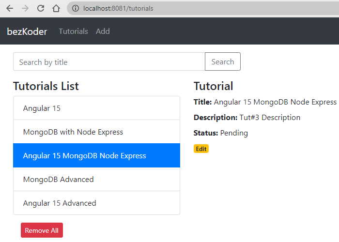

# Angular 15 Node.js MongoDB example: CRUD Application

In this tutorial, I will show you how to build a full-stack (MEAN stack) Angular 15 + Node.js + MongoDB example with a CRUD Application. The back-end server uses Node.js + Express for REST APIs and connects with MongoDB database, front-end side is an Angular App with HTTPClient.

We will build a full-stack Tutorial Application in that:
- Tutorial has id, title, description, published status.
- User can create, retrieve, update, delete Tutorials.
- There is a search box for finding Tutorials by title.



Tutorial link: 

> [MEAN stack with Angular 15 CRUD example](https://www.bezkoder.com/angular-15-node-js-express-mongodb/)

For more detail, please visit:
> [Angular 15 CRUD example with Web API](https://www.bezkoder.com/angular-15-crud-example/)

> [Node.js, Express & MongoDb: Build a CRUD Rest Api example](https://www.bezkoder.com/node-express-mongodb-crud-rest-api/)

> [How to integrate Angular with Node.js Restful Services](https://www.bezkoder.com/integrate-angular-12-node-js/)

Security:
> [Angular 15 + Node.js Express: JWT Authentication and Authorization example](https://www.bezkoder.com/node-js-angular-15-jwt-auth/)

Associations:
> [MongoDB One-to-One relationship tutorial with Mongoose examples](https://www.bezkoder.com/mongoose-one-to-one-relationship-example/)

> [MongoDB One-to-Many Relationship tutorial with Mongoose examples](https://www.bezkoder.com/mongoose-one-to-many-relationship/)

> [MongoDB Many-to-Many Relationship with Mongoose examples](https://www.bezkoder.com/mongodb-many-to-many-mongoose/)

## Project setup

### Node.js Server
```
cd node-js-server
npm install
```
Run `node server.js`

### Angular Client
```
cd angular-15-client
npm install
```
Run `ng serve --port 8081`. Navigate to `http://localhost:8081/`.